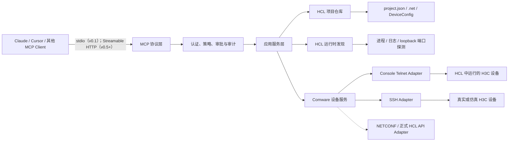
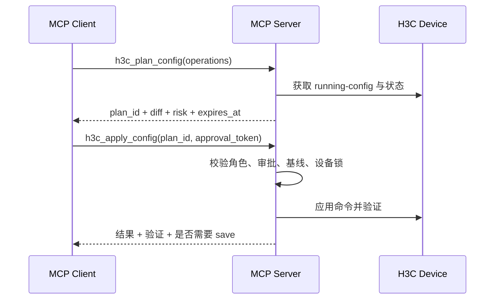
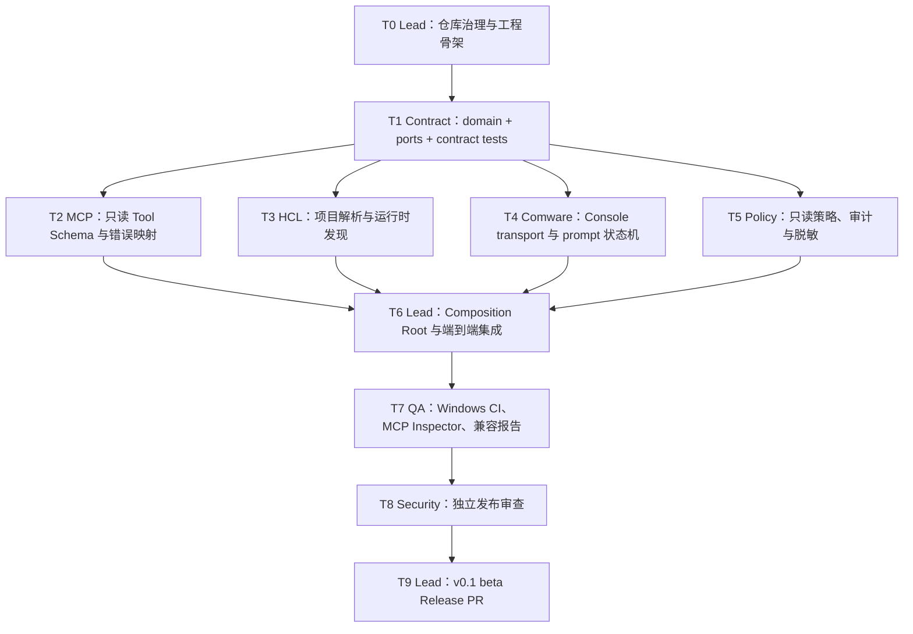

# HCL/H3C 专用 MCP Server 架构设计

> 文档状态：已实施基线 / `v0.1.0-beta.2` 候选
> 目标版本：v0.1（本机 HCL 实验设备只读接入）→ v1.0（受控配置变更）  
> 目标仓库：[FlySun1116/HCL-Lab_mcp](https://github.com/FlySun1116/HCL-Lab_mcp)  
> 调研基线：2026-07-16，本机 H3C Cloud Lab 5.10.3；代码候选版本 `0.1.0-beta.2`

## 1. 摘要

本项目拟在 GitHub 仓库 **`FlySun1116/HCL-Lab_mcp`** 建设一个开源的 HCL/H3C MCP Server，使 Claude Desktop、Claude Code、Cursor 及其他 MCP Client 能发现 HCL 实验拓扑，连接实验中的 H3C/Comware 设备，执行查询、诊断和受控配置任务。仓库不仅承载代码，也承载接口契约、架构决策、兼容性证据、Agent 工作说明和可复现发布流程，使人类维护者或 Claude Agent Team 都能接管后续开发。

首期采用以下原则：

1. **本地优先**：MCP Server 与 HCL 运行在同一台 Windows 主机，通过 `stdio` 服务单用户客户端。
2. **设备通道优先**：通过 HCL 为设备控制台提供的本机 Telnet 端口操作 Comware CLI；真实设备可切换到 SSH。
3. **文件发现、运行时探测**：读取用户自己的 `project.json`、`.net` 和设备配置快照来构建拓扑，不修改 HCL 安装文件。
4. **默认只读**：v0.1 仅开放拓扑查询、`display` 类命令和诊断工具；配置写入默认关闭。
5. **适配器隔离**：MCP、业务服务、HCL 项目解析、Comware CLI 会话相互解耦，便于未来加入 SSH、NETCONF 或厂商正式 API。
6. **不依赖未公开私有协议**：本机日志显示 HCL 内部存在 TCP 控制服务，但本项目不复制、反编译或发布其私有协议实现。设备启停等生命周期能力只有在获得厂商公开接口或明确授权后才进入稳定版。
7. **契约先行、Agent 友好**：公共模型和 Port 接口先冻结，再允许多个 Agent 按目录并行实现；共享入口、依赖和版本文件由 Team Lead 独占。

推荐的 v0.1 交付形态是 Python 包 `h3c-hcl-mcp` 和本机 `stdio` Server。当前 beta.2 尚未发布到 PyPI，测试者应从源码创建虚拟环境并直接启动 `h3c-hcl-mcp`；正式发布后才启用 `uvx h3c-hcl-mcp` 安装路径。Streamable HTTP 计划在 v0.5 以后提供。

---

## 2. 本地 HCL 调研结论

### 2.1 已验证事实

| 项目 | 本机验证结果 | 对设计的影响 |
|---|---|---|
| HCL 版本 | H3C Cloud Lab 5.10.3 | 首期兼容基线定为 5.10.x |
| 安装目录 | 当前机器为 `F:\\HCL`，不可硬编码 | 通过配置、注册表/进程和常见路径自动发现 |
| 虚拟化 | HCL 日志显示 VirtualBox 6.0.14 | MCP Server 不直接操作 VirtualBox，避免越过 HCL 状态机 |
| HCL 组件 | `SimwareClient.exe`、`SimwareMultiCC.exe`、`SimwareWrapper.exe` | 仅用于健康探测，不嵌入、不再分发 |
| 用户项目 | `%USERPROFILE%\\HCL\\Projects\\<project-id>` | 作为默认项目发现根目录 |
| 项目元数据 | `project.json` 包含项目名称、设备名、类别、型号、版本、配置路径 | 可稳定生成项目和设备清单 |
| 拓扑文件 | `<project-id>.net`，嵌套 INI/ConfigObj 风格 | 可解析设备、`device_id`、端口、链路、内存和坐标 |
| 配置快照 | `DeviceConfig\\<device>.cfg` | 可做离线读取、差异对比和备份来源 |
| 设备控制台 | HCL 为运行设备创建本机 Telnet 端口；样本曾出现 `telnet_base + device_id` | v0.1 主要执行通道；beta.2 不使用公式产生候选，只接受日志绑定并完成 prompt 探测的 endpoint |
| 控制台桥接 | 日志显示命名管道形如 `\\.\\pipe\\topo1-device1` | MCP Server 不直接访问命名管道，只连接 HCL 暴露的 loopback Telnet |
| HCL 内部端口 | 本机观察到 16500、16600、18600 等 TCP 服务，部分监听 `0.0.0.0` | 视为 HCL 私有内部接口；不向 MCP Client 暴露，并建议用防火墙限制 |
| 本机设备型号 | MSR36、S6850、S5800、VSR-88、F1060/F1090、PC 等 | 建立 Comware 7 通用驱动和型号能力矩阵 |
| Comware 版本 | 样本包含 7.1.064、7.1.070、7.1.075 | CLI prompt、分页和输出解析需做版本兼容 |

### 2.2 可用集成边界

稳定且可开源的边界：

- 读取用户创建的 HCL 项目文件；
- 只读检查 HCL 进程、日志和本机监听端口；
- 连接 HCL 正常提供的设备控制台 Telnet 服务；
- 通过设备自身支持的 SSH/NETCONF 管理接口连接 H3C 设备；
- 调用未来由 H3C 正式公开或授权的 HCL API。

不进入开源仓库的内容：

- HCL 可执行文件、DLL、VMDK/VDI 镜像、图标、帮助文档及原始设备模板；
- 从 HCL 二进制反编译、反汇编或复制的代码与私有协议；
- 用户真实拓扑、设备配置、口令、Token、日志或其他敏感数据；
- 以 H3C/HCL 官方产品身份进行宣传的商标或视觉资产。

本机许可文件明确限制软件复制、传播、反向工程和派生开发，因此开源包必须是一个独立的互操作层，由使用者另行合法安装 HCL。

---

## 3. 目标与非目标

### 3.1 目标

- MCP Client 能列出本机 HCL 项目、设备和链路。
- 能定位运行中的设备控制台并可靠执行 Comware 查询命令。
- 返回结构化、大小受控、可审计的结果，而不是无边界终端转储。
- 写操作具有计划、确认、锁、超时、备份和回滚边界。
- 相同工具模型可用于 HCL 仿真设备和真实 H3C 设备。
- 项目可通过 PyPI/GitHub 独立发布，不携带任何 HCL 专有组件。

### 3.2 非目标

- 不替代 HCL 的拓扑编辑 GUI。
- 不绕过 HCL 许可、认证或资源限制。
- v0.1 不自动创建拓扑、不直接调用 HCL 私有控制端口、不管理 VirtualBox。
- 不承诺任意 Comware 命令输出都能结构化解析；未知输出保留为受限的原始文本。
- 不允许模型在无策略约束下执行任意 CLI、Shell 或文件操作。

---

## 4. 总体架构



### 4.1 分层职责

| 层 | 职责 | 禁止事项 |
|---|---|---|
| MCP 协议层 | 工具注册、JSON Schema、结构化结果、进度和错误映射 | 不包含设备协议逻辑 |
| 策略层 | 身份、角色、只读/写入策略、审批令牌、速率限制、审计 | 不拼接 CLI 文本 |
| 应用服务层 | 项目/设备定位、任务编排、锁、差异、备份 | 不依赖具体传输库 |
| HCL 适配层 | 项目解析、运行时发现、控制台端口解析 | 不实现未授权私有协议 |
| Comware 适配层 | prompt 识别、分页关闭、命令执行、输出解析 | 不启动 Shell，不使用 `eval` |
| 基础设施层 | 配置、日志、SQLite 审计、密钥、指标 | 不记录明文口令 |

### 4.2 核心领域对象

- `LabProject`：`id`、`name`、`path`、HCL 版本、更新时间。
- `DeviceRef`：`project_id`、`device_id`、`name`、`model`、`version`。
- `Link`：本端设备/接口、对端设备/接口、链路类型。
- `RuntimeEndpoint`：通道类型、loopback 地址、端口、发现来源、可信度、探测时间。
- `CommandRequest`：目标、命令类型、超时、最大输出、期望 prompt。
- `CommandResult`：标准输出、解析数据、prompt、耗时、截断标记和警告。
- `ChangePlan`：规范化命令、影响摘要、配置基线哈希、过期时间和审批状态。
- `AuditEvent`：调用者、工具、目标、策略结果、调用结果、错误码、请求 ID 和时间；`policy_result` 与 `outcome` 分开记录。

### 4.3 模块边界与公共契约

代码按六个可独立测试的边界组织，跨边界只能依赖 `domain` 数据模型和 `ports` 协议：

| 模块 | 拥有内容 | 允许依赖 | 不允许依赖 |
|---|---|---|---|
| `domain` | 领域对象、值对象、稳定错误码、纯校验 | Python 标准库、Pydantic | MCP SDK、文件系统、网络、数据库 |
| `ports` | `Protocol`/ABC 形式的外部能力契约 | `domain` | 任一具体 adapter、MCP SDK |
| `application` | 用例编排、锁、缓存、变更计划、Job | `domain`、`ports` | Telnet/SSH/文件解析实现 |
| `mcp` | Tool/Resource/Prompt Schema、错误映射、Server 组装 | `application`、`domain` | 直接读取 HCL 文件或连接设备 |
| `adapters` | HCL 项目/运行时、Comware 传输与解析 | `domain`、`ports` | `mcp`、其他 adapter 的内部实现 |
| `infrastructure` | 配置、审计存储、密钥、日志、指标 | `domain`、`ports` | MCP Tool 业务逻辑 |

首批必须冻结的 Port：

```text
ProjectRepository     list_projects / get_project / get_topology
RuntimeDiscovery      discover_project / discover_device
DeviceTransport       connect / execute / execute_config / close
CommandParser         supports / parse
PolicyEngine          authorize / validate_command / validate_change
ApprovalProvider      issue / verify / consume
AuditSink             append / query
JobStore              create / update / get / cancel
SecretProvider        get_secret
Clock                 now
```

边界规则：

1. 所有 Port 的输入输出必须是 `domain` 中的强类型对象，不传裸字典、第三方库对象或打开的 socket/file handle。
2. `application` 只面向 Port 编程；测试使用内存 fake，不能通过 monkeypatch 私有 adapter 细节来完成主流程测试。
3. Adapter 将第三方异常转换为稳定领域错误；MCP 层再将领域错误转换为 Tool 结果。
4. 新增 adapter 不得修改既有 Tool Schema；如确需改变公共契约，先提交 ADR 和契约测试。
5. 跨模块新增依赖必须由 `CODEOWNERS` 中的架构维护者批准，并通过依赖方向检查。

### 4.4 架构决策记录

对不可逆或跨模块决策使用 `docs/adr/NNNN-title.md`，至少记录 Context、Decision、Alternatives、Consequences 和 Status。以下决策应在第一个代码 PR 中建立：

- ADR-0001：采用 Python 3.12 与官方 MCP Python SDK 稳定线；
- ADR-0002：默认 stdio，本机 HCL 不通过远程连接器暴露；
- ADR-0003：HCL 项目文件 + loopback console 为 v0.x 集成边界；
- ADR-0004：Hexagonal Architecture 与模块依赖方向；
- ADR-0005：默认只读、计划/审批分离的配置变更模型；
- ADR-0006：不实现或发布未授权 HCL 私有控制协议。

---

## 5. MCP Tools 列表

### 5.1 命名和返回约定

工具使用稳定的 `lower_snake_case` 名称。HCL 项目能力使用 `hcl_` 前缀，设备能力使用 `h3c_` 前缀，异步任务使用 `job_` 前缀。

所有工具返回统一结构：

```json
{
  "ok": true,
  "request_id": "01J...",
  "target": {"project_id": "lab-1", "device": "S6850_1"},
  "changed": false,
  "data": {},
  "warnings": [],
  "duration_ms": 132,
  "truncated": false
}
```

错误使用稳定错误码，例如 `PROJECT_NOT_FOUND`、`DEVICE_NOT_RUNNING`、`CONSOLE_UNAVAILABLE`、`PROMPT_TIMEOUT`、`COMMAND_DENIED`、`APPROVAL_REQUIRED`、`BASELINE_CHANGED`。设备输出属于不可信外部数据，结果中标注 `content_trust: "untrusted_device_output"`。beta.2 在 ToolManager 边界统一处理 Schema failure、未知 Tool 和 `server.max_tool_seconds` 全局超时，分别返回带 `request_id` 的 `INVALID_ARGUMENT` 或 `TIMEOUT`，并写入同一审计事件。

### 5.2 v0.1 核心工具（默认只读）

| Tool | 主要输入 | 输出 | 风险/说明 |
|---|---|---|---|
| `server_health` | `deep=false` | Server 版本、状态和依赖摘要 | 只读；`deep=true` 枚举项目并对首个项目执行运行时发现 |
| `hcl_list_projects` | `query?`、`limit?` | 项目摘要列表 | 只读取允许的项目根目录；不返回绝对路径 |
| `hcl_get_topology` | `project_id` | 设备、链路和拓扑校验警告 | 拒绝路径穿越和项目根目录逃逸 |
| `hcl_get_runtime` | `project_id` | HCL 进程状态、设备运行态、控制台可用性和发现依据 | 不连接 HCL 私有控制端口 |
| `h3c_list_devices` | `project_id` | H3C/Comware 候选设备及 `operable` 状态 | 聚合项目与运行时数据；过滤 PC/终端节点 |
| `h3c_get_facts` | `project_id`、`device_id` | sysname、Comware 版本、uptime、型号等 | 执行受控 `display version` |
| `h3c_run_display` | `project_id`、`device_id`、`command`、`timeout?` | 原始输出及可用的结构化字段 | 仅允许只读白名单；输出强制脱敏并受配置上限约束 |
| `h3c_get_config` | `project_id`、`device_id`、`source=running|startup`、`redact=true` | 脱敏配置及来源 | v0.1 拒绝 `redact=false`；不支持 `snapshot` |
| `h3c_get_interfaces` | `project_id`、`device_id` | 接口管理/协议状态、速率、描述、地址 | 当前执行 `display interface brief` |
| `h3c_ping` | `project_id`、`device_id`、`destination`、`count?` | 成功率、RTT、原始摘要 | `count` 范围 1～100，目标和命令强校验 |
| `h3c_trace_route` | `project_id`、`device_id`、`destination`、`max_hops?` | 跳点列表 | `max_hops` 范围 1～255，总超时受限 |
| `h3c_diff_config` | `project_id`、`device_id`、`candidate?` | `NOT_IMPLEMENTED` 错误 | beta.2 仅保留稳定名称，不执行差异 |

beta.2 的公开 Tool Schema 使用独立的 `project_id` 和 `device_id` 参数。以下结构化 `target` 是 v0.2 评估项，尚未进入已注册 Schema：

```json
{
  "project_id": "hcl_1e910d518140",
  "device_id": 1,
  "device_name": "S6850_1"
}
```

若后续引入 `target`，至少提供 `project_id + device_id` 或 `project_id + device_name`；如果两者同时提供，必须一致，并通过 ADR 与契约测试迁移现有 Schema。

beta.2 共注册 15 个 namespaced Tool：本节 12 个、`job_get`、`job_cancel` 和 `audit_query`。`list_devices`、`execute_command`、`configure_device`、`get_device_status`、`ping_test` 等短名称不是公开 Tool；是否提供兼容 alias 仍按 `docs/TOOL_ALIAS_PROPOSAL.md` 决策，不能由开发 Agent 擅自增加。

### 5.3 v0.2 受控写工具（默认关闭）

| Tool | 主要输入 | 行为 | 安全约束 |
|---|---|---|---|
| `h3c_plan_config` | `target`、结构化 `operations` 或候选配置 | 验证命令、生成 diff、风险等级和短期 `plan_id` | 不执行；记录运行配置基线哈希 |
| `h3c_apply_config` | `plan_id`、`approval_token` | 在单设备锁内应用已批准计划 | 计划过期或基线变化即拒绝；失败进入清理/回滚流程 |
| `h3c_save_config` | `target`、`approval_token` | 保存当前配置 | 与 apply 分离，避免误覆盖 startup-config |
| `h3c_set_interface_state` | `target`、`interface`、`enabled`、`approval_token` | 执行 `shutdown`/`undo shutdown` | 结构化操作；禁止任意命令 |
| `h3c_backup_config` | `target`、`label?` | 读取、脱敏并保存加密或权限受控快照 | 返回 snapshot ID，不返回服务器绝对路径 |
| `h3c_restore_config` | `target`、`snapshot_id`、双重确认 | 生成并应用恢复计划 | 高风险；默认策略禁用 |

推荐的写入流程：



### 5.4 管理员工具

| Tool | 用途 | 默认状态 |
|---|---|---|
| `h3c_run_commands` | 执行经过策略引擎审核的高级 CLI 序列 | 规划项；beta.2 未注册 |
| `job_get` | 查询长任务进度、阶段和部分结果 | 已注册；beta.2 JobStore 为占位实现，尚无生产 Job |
| `job_cancel` | 请求取消尚未进入不可中断阶段的任务 | 已注册；beta.2 JobStore 为占位实现，尚无生产 Job |
| `audit_query` | 按请求 ID、工具、设备和时间查询审计摘要 | 已注册；默认使用本地 SQLite，关闭审计时返回空结果且不创建数据库 |

### 5.5 HCL 生命周期工具（规划项）

以下工具只有在 H3C 提供正式接口、SDK 或明确集成授权后实现；稳定版不得通过复刻本机私有 TCP 协议实现：

- `hcl_start_devices`
- `hcl_stop_devices`
- `hcl_start_all`
- `hcl_stop_all`
- `hcl_create_project`
- `hcl_add_device`
- `hcl_connect_interfaces`
- `hcl_export_project`

在此之前，`hcl_get_runtime` 若发现设备未运行，应返回可操作提示：“请在 HCL 中打开项目并启动目标设备”，而不是尝试绕过 GUI 状态机。

### 5.6 可选 MCP Resources 与 Prompts

虽然首要交付是 Tools，仍建议提供只读 Resources，减少模型重复调用：

- `hcl://projects`
- `hcl://projects/{project_id}/topology`
- `hcl://projects/{project_id}/devices/{device_id}/facts`
- `hcl://projects/{project_id}/devices/{device_id}/config-snapshot`
- `h3c://capabilities/{model}/{version}`

建议内置 Prompts：`diagnose_link_failure`、`review_config_change`、`collect_support_bundle`。Prompt 只编排工具，不提高调用者权限。

---

## 6. 项目目录结构

```text
HCL-Lab_mcp/
├─ pyproject.toml
├─ uv.lock
├─ README.md
├─ CLAUDE.md                       # 所有 Claude 会话共享的项目规则
├─ CONTRIBUTING.md
├─ GOVERNANCE.md
├─ CODE_OF_CONDUCT.md
├─ LICENSE
├─ NOTICE
├─ SECURITY.md
├─ CHANGELOG.md
├─ .github/
│  ├─ CODEOWNERS
│  ├─ dependabot.yml
│  ├─ PULL_REQUEST_TEMPLATE.md
│  ├─ ISSUE_TEMPLATE/
│  │  ├─ bug.yml
│  │  ├─ feature.yml
│  │  └─ adapter.yml
│  └─ workflows/
│     ├─ ci.yml
│     ├─ security.yml
│     ├─ docs.yml
│     └─ release.yml
├─ .claude/
│  ├─ settings.example.json        # Agent Team opt-in 与安全 hooks 示例
│  └─ agents/
│     ├─ team-lead.md
│     ├─ contract-architect.md
│     ├─ mcp-api-engineer.md
│     ├─ hcl-adapter-engineer.md
│     ├─ comware-driver-engineer.md
│     ├─ security-reviewer.md
│     └─ qa-release-engineer.md
├─ docs/
│  ├─ design.md
│  ├─ configuration.md
│  ├─ security-model.md
│  ├─ compatibility.md
│  ├─ agent-team-playbook.md
│  ├─ release-process.md
│  └─ adr/
├─ src/
│  └─ h3c_hcl_mcp/
│     ├─ __init__.py
│     ├─ __main__.py
│     ├─ domain/
│     │  ├─ errors.py
│     │  ├─ project.py
│     │  ├─ device.py
│     │  ├─ command.py
│     │  ├─ change.py
│     │  ├─ result.py
│     │  └─ audit.py
│     ├─ ports/
│     │  ├─ project_repository.py
│     │  ├─ runtime_discovery.py
│     │  ├─ device_transport.py
│     │  ├─ command_parser.py
│     │  ├─ policy_engine.py
│     │  ├─ approval_provider.py
│     │  ├─ audit_sink.py
│     │  ├─ job_store.py
│     │  └─ secret_provider.py
│     ├─ application/
│     │  ├─ project_service.py
│     │  ├─ runtime_service.py
│     │  ├─ device_service.py
│     │  ├─ change_service.py
│     │  ├─ backup_service.py
│     │  └─ job_service.py
│     ├─ mcp/
│     │  ├─ server.py              # 唯一 Composition Root
│     │  ├─ validation_middleware.py # 稳定 call/register 边界
│     │  ├─ sdk_compat.py           # SDK 私有兼容点唯一隔离层
│     │  ├─ error_mapping.py
│     │  ├─ tools/
│     │  │  ├─ health.py
│     │  │  ├─ hcl_projects.py
│     │  │  ├─ hcl_runtime.py
│     │  │  ├─ h3c_read.py
│     │  │  ├─ h3c_change.py
│     │  │  ├─ jobs.py
│     │  │  └─ audit.py
│     │  ├─ resources/
│     │  └─ prompts/
│     ├─ adapters/
│     │  ├─ hcl/
│     │  │  ├─ project_repository.py
│     │  │  ├─ net_parser.py
│     │  │  ├─ runtime_discovery.py
│     │  │  ├─ log_observer.py
│     │  │  └─ official_api.py    # 仅留接口，默认无实现
│     │  └─ comware/
│     │     ├─ base.py
│     │     ├─ session.py
│     │     ├─ prompt.py
│     │     ├─ console_telnet.py
│     │     ├─ ssh.py
│     │     ├─ netconf.py
│     │     ├─ capabilities.py
│     │     └─ parsers/
│     │        ├─ facts.py
│     │        ├─ interfaces.py
│     │        ├─ routes.py
│     │        └─ textfsm/
│     └─ infrastructure/
│        ├─ settings.py
│        ├─ policy/
│        │  ├─ engine.py
│        │  ├─ command_rules.py
│        │  ├─ approvals.py
│        │  └─ roles.py
│        ├─ audit/
│        │  ├─ store.py
│        │  ├─ redact.py
│        │  └─ schema.sql
│        ├─ secrets.py
│        ├─ logging.py
│        └─ telemetry.py
├─ config/
│  ├─ config.example.yaml
│  ├─ policy.readonly.example.yaml
│  └─ policy.lab-admin.example.yaml
├─ packaging/
│  ├─ mcpb/
│  │  └─ manifest.json
│  └─ windows/
├─ tests/
│  ├─ unit/
│  │  ├─ domain/
│  │  ├─ application/
│  │  └─ adapters/
│  ├─ contract/
│  ├─ integration/
│  ├─ e2e/
│  └─ fixtures/
│     ├─ synthetic_projects/      # 自造数据，不复制 HCL 内容
│     └─ device_outputs/
└─ scripts/
   ├─ check_docs.py
   ├─ check_repository.py
   └─ check_distribution.py
```

依赖方向固定为 `mcp → application → ports ← adapters/infrastructure`，`domain` 位于最内层。只有 `mcp/server.py` 可以实例化并装配具体 adapter。任何 Tool 都不能直接读文件、连 Telnet 或执行命令。

`.claude/agents/` 保存可复用角色定义；不要在仓库中创建或维护 `~/.claude/teams/`、`~/.claude/tasks/` 的副本，这些是 Claude Code 自动维护的会话运行态，不是项目配置。

---

## 7. 技术路线

### 7.1 语言与 MCP SDK

- **Python 3.12**：Windows 兼容良好，异步网络和文本解析生态成熟；不要复用 HCL 自带的 Python 3.8 运行时。
- **官方 MCP Python SDK**：beta.2 锁定 `mcp>=1.28.1,<1.29`。Tool 注册/调用使用公开 `add_tool`、`call_tool` 和 `list_tools`；FastMCP 未公开的 server version 设置只允许出现在 `mcp/sdk_compat.py`，并由运行时结构守卫与官方 stdio 测试保护。任何 SDK patch/minor 升级都必须重跑完整协议门禁。
- **Pydantic v2**：定义输入、输出和配置 Schema，使 MCP 工具返回结构化结果。
- **uv**：依赖锁定、开发运行、构建和干净环境验证；PyPI 发布完成后再提供 `uvx` 分发。

MCP 当前标准传输是 `stdio` 和 Streamable HTTP。`stdio` 用于由 Claude Desktop/Cursor 启动的本机单用户进程；Streamable HTTP 用于受控的多客户端服务。MCP 标准要求 HTTP 端点校验 `Origin`，本地服务应只绑定 loopback 并进行认证。

参考：

- [MCP Transports 规范](https://modelcontextprotocol.io/specification/2025-11-25/basic/transports)
- [MCP Tools 规范](https://modelcontextprotocol.io/specification/2025-11-25/server/tools)
- [官方 MCP Python SDK](https://github.com/modelcontextprotocol/python-sdk)
- [MCP Security Best Practices](https://modelcontextprotocol.io/docs/tutorials/security/security_best_practices)

### 7.2 HCL 项目发现

1. 按配置读取一个或多个 `projects_dirs`。
2. beta.2 只接受项目根目录直属子目录；项目 ID 不得为空、为绝对路径、包含分隔符或 `..`，解析后的真实路径必须仍位于配置根目录内。
3. `project.json` 的 `projectInfo`/`deviceInfoList` 作为设备元数据来源，`.net` 的嵌套 `[vbox]` / `[[MODEL name]]` 段作为拓扑关系和 `device_id` 权威来源。
4. 两种文件按设备名称（大小写不敏感）合并；链路去重；缺项或冲突形成确定性 warning，不凭列表顺序猜测 ID。
5. 项目响应不向 MCP Client 返回服务器绝对路径；路径相关异常在 MCP 边界再次脱敏。
6. 文件采用短时只读打开，不长期持有 HCL 可能正在写入的句柄；阻塞式扫描/解析通过 worker thread 执行，不占用 stdio event loop。
7. `config_path` 只保留在内部领域对象，不进入公开 topology DTO；项目路径、设备 buffer 和其他未可信输出也不得进入错误详情。

`.net` 解析器必须实现确定性语法或使用安全的 ConfigObj 解析库；禁止对端口字典等字段使用 Python `eval`。测试夹具全部由项目自行构造。

### 7.3 运行时与控制台发现

beta.2 的实际发现流程：

1. `ProjectAwareRuntimeDiscovery` 在每次项目级或设备级查询前读取拓扑，并把设备 ID/名称注册到 runtime adapter，消除调用顺序依赖。
2. 使用公开的 Windows 卸载注册表元数据、显式 `install_dir` 和常见目录定位 HCL 5.10.x 日志；进程检测只表示 HCL 可能运行，不表示任何具体设备已启动。
3. 按时间顺序归并轮转日志，解析 project binding、console created、console closed 和 topology alias rebound。只有明确绑定到目标项目/设备且未关闭的日志端口才成为 candidate。
4. candidate 必须是 loopback 地址，并通过有界 TCP/Telnet 探测与 Comware prompt 识别。探测最多发送空 CRLF 以唤醒 prompt，永不回答 login/password，也不执行设备命令。
5. 验证成功后才发布 `source=probe`、`confidence=1` 的 endpoint；项目级与设备级查询共享 2 秒运行时缓存。

`fallback_telnet_base` 为配置兼容字段，beta.2 不用它生成 candidate，更不会用 `base + device_id` 公式声明设备可操作。`max_probe_ports` 只限制已有日志 candidate 的探测数量。禁止扫描局域网、连接非 loopback 地址，或把 HCL 内部 16500/16600/18600 作为设备控制台。

### 7.4 Comware CLI 会话

定义统一 `DeviceTransport` 接口：

```text
connect() -> Session
execute(command, timeout, max_chars) -> CommandResult
execute_config(commands, timeout) -> CommandResult
close()
```

beta.2 已实现：

- `ConsoleTelnetTransport`：连接 HCL loopback Telnet 控制台；处理 Telnet IAC、启动噪声、回显、分页和重连。
- `DeviceSessionManager` / `SessionManagerTransport`：按设备序列化连接，并使用 task-local 上下文防止并发请求跨设备路由。
- prompt 失败、命令超时、EOF、取消、输出截断都会关闭并失效底层连接；只有收到完整 final prompt 且流仍打开时才允许会话复用，避免迟到输出跨调用污染。

后续实现：

- `SshTransport`：用于已配置管理 IP 的仿真或真实 H3C 设备；严格校验 host key。beta.2 中仅有返回 `NOT_IMPLEMENTED` 的 adapter 占位。
- `NetconfTransport`：按设备能力使用 NETCONF over SSH，提供结构化配置事务；上线前需按具体型号/Comware 版本验证支持矩阵。

会话状态机应识别：

- 用户视图 `<sysname>`；
- 系统/接口等配置视图 `[sysname]`、`[sysname-interface-...]`；
- 首次启动、登录名、密码、确认提示；
- `---- More ----` 等分页提示；
- 设备重启、连接关闭和 prompt 改名。

连接建立后先执行最小初始化（例如关闭当前会话分页），结束时尽力回到用户视图。Telnet IAC 过滤器必须跨 TCP chunk 保留协商状态，不能假设 IAC 序列在一次读取中完整到达。v0.1 的 transport 边界只接受 `console_telnet` 和 loopback 地址；所有设备命令在 **每设备独占锁** 内执行，防止两个 Client 共享状态化 CLI 会话。会话管理器落实全局连接上限、空闲超时和单会话命令次数回收，Server lifespan 退出时关闭全部底层连接。

### 7.5 输出解析与上下文控制

- 命令执行层始终保留规范化 raw 输出；解析器以 `(model, version, command)` 选择模板。
- 常用 `display version`、接口、路由、LLDP、ARP、MAC 地址表优先结构化。
- 返回内容默认限制 32 KiB；可配置上限不超过策略值，并明确 `truncated=true`。
- 大配置保存为短期资源或快照，Tool 返回摘要、哈希和资源 URI，避免淹没模型上下文。
- 日志、banner、接口 description 和设备输出均视为不可信数据，不得解释为 MCP Server 指令。

### 7.6 并发与长任务

- 全局限制并发设备数，每设备仅允许一个活动 CLI 会话。
- 查询操作设置硬超时；超时后清理缓冲区并重新验证 prompt。
- 批量采集和未来的设备启动使用 Job 模型；beta.2 仅注册 `job_get`/`job_cancel` 契约，尚无创建生产 Job 的用例。
- 取消是尽力而为；进入写设备的临界区后必须先完成一致性清理再结束。

### 7.7 安全模型

风险级别：

| 级别 | 示例 | 默认策略 |
|---|---|---|
| R0 | 项目/拓扑/缓存信息读取 | 允许 |
| R1 | `display`、ping、tracert | 允许，但限频和审计 |
| R2 | 接口启停、候选配置应用 | 默认拒绝；需角色与一次性审批 |
| R3 | 保存/恢复配置、重启、批量变更 | 默认禁用；需双重确认或运维系统审批 |

关键控制：

- `read_only` 是默认策略，不能仅靠 MCP 客户端的确认 UI。
- `h3c_run_display` 使用命令 AST/严格前缀白名单，拒绝换行、分号、管道、重定向和不可见控制字符。
- 写操作使用短期 `plan_id` + 单次 `approval_token`，绑定调用者、目标、操作哈希和过期时间。
- 所有文件路径必须 `resolve` 后仍位于允许根目录；拒绝路径穿越和指向根目录外的链接。
- 未来 HTTP 模式只允许绑定 `127.0.0.1` 或受控管理网，并在发布前实现 OAuth 2.1/企业 IdP、TLS、Origin/Host 校验和速率限制；v0.1 拒绝 HTTP transport。
- `stdio` 模式 stdout 只能输出 MCP JSON-RPC，日志全部写 stderr。
- 官方 `tools/call` 边界把 Schema 失败规范化为结构化 `INVALID_ARGUMENT`；不回传 Pydantic `input_value`、文档 URL 或本机路径。
- 审计开启时，响应与事件复用同一 `request_id`，保留稳定错误码；`policy_result` 只表示策略裁决，`outcome` 单独表示调用成功或失败。
- 审计开启但事件无法持久化时调用 fail closed，返回稳定 `INTERNAL_ERROR` 和 `AUDIT_UNAVAILABLE` reason，不允许产生未审计成功。
- 口令只通过环境变量引用、系统凭据库或外部 Secret Provider 获取；日志中统一脱敏。
- HCL 当前内部服务被观察到可能监听所有网卡，安装指引应建议 Windows Defender Firewall 阻止 16500/16600/186xx 的外部入站访问。
- 不把设备返回文本直接拼接为新的命令，防止设备 banner 或配置内容造成间接 prompt/command injection。

---

## 8. 配置方式

### 8.1 优先级

配置优先级从高到低：

1. 命令行参数（当前为 `--projects-dir`，可重复）；
2. `H3C_HCL_MCP__...` 嵌套环境变量；
3. `--config` 或 `H3C_HCL_MCP_CONFIG` 显式选择的 YAML/JSON；
4. Windows `%LOCALAPPDATA%\h3c-hcl-mcp\config.yaml|config.yml|config.json`；
5. 程序安全默认值。

没有配置文件时 Server 以只读、stdio 安全默认值正常启动；显式选择的文件缺失、格式损坏、字段未知或值越界时，在启动 MCP 协议前以退出码 1 失败。路径字段支持环境变量和用户目录展开。列表型环境变量使用 JSON，例如 `H3C_HCL_MCP__HCL__PROJECTS_DIRS='["D:\\HCL\\Projects"]'`。敏感项不得写入仓库 YAML，日志绝不回显密钥值。

### 8.2 `config.yaml` 示例

```yaml
server:
  name: h3c-hcl-mcp
  transport: stdio              # v0.1 只接受 stdio
  log_level: INFO
  max_tool_seconds: 60
  max_output_chars: 32768
  max_tool_result_bytes: 262144

hcl:
  install_dir: "F:\\HCL"       # 可省略并自动发现
  projects_dirs:
    - "${USERPROFILE}\\HCL\\Projects"
  supported_versions: ["5.10.*"]
  runtime_discovery:
    process_inspection: true
    log_observation: true
    loopback_probe: true
    console_host: 127.0.0.1
    max_probe_ports: 32
  private_control_api:
    enabled: false

devices:
  preferred_transports: [console_telnet] # SSH 计划在 v0.2 实现
  connect_timeout_seconds: 5
  command_timeout_seconds: 20
  per_device_concurrency: 1
  ssh:
    username_env: H3C_HCL_MCP_SSH_USERNAME
    password_env: H3C_HCL_MCP_SSH_PASSWORD
    known_hosts: "${USERPROFILE}\\.ssh\\known_hosts"

policy:
  mode: read_only               # v0.1 不注册配置写 Tool
  allow_display_prefixes: []    # 空=内置 allowlist；非空只能进一步收紧
  deny_patterns: []             # 额外、不区分大小写的字面子串拒绝规则
  require_approval_for_writes: true
  plan_ttl_seconds: 300

audit:
  enabled: true
  database: "${LOCALAPPDATA}\\h3c-hcl-mcp\\audit.db"
  retention_days: 90
  store_raw_device_output: false
```

完整示例见 `config/config.example.yaml` 和 `config/config.example.json`。`console_host` 必须是 loopback，v0.1 的 `preferred_transports` 默认且仅可使用 `console_telnet`；SSH 计划在 v0.2 实现。`allow_display_prefixes=[]` 使用内置 display allowlist；非空时只能取其更小子集，不能放宽内置规则。`deny_patterns` 是额外的、不区分大小写的字面子串拒绝规则。两者均不能覆盖内置命令注入和危险命令检查。配置模型仍保留 `fallback_telnet_base` 兼容字段，但 beta.2 不使用它生成 candidate；可用 endpoint 必须来自明确日志绑定并经过 prompt 验证。`audit.enabled=false` 使用空实现，不创建 SQLite 文件。

### 8.3 Claude Desktop（本机 stdio）

本机 HCL 只能由同一主机访问，因此 Claude Desktop 推荐本地 `stdio` 配置。beta.2 尚未发布 PyPI，先在仓库执行 `uv sync --extra dev`，再把 `command` 指向源码虚拟环境中的可执行文件：

```json
{
  "mcpServers": {
    "h3c-hcl": {
      "command": "C:\\path\\to\\HCL-Lab_mcp\\.venv\\Scripts\\h3c-hcl-mcp.exe",
      "args": [
        "--projects-dir",
        "C:\\Users\\YOUR_NAME\\HCL\\Projects"
      ]
    }
  }
}
```

后续可发布 `.mcpb` Desktop Extension，利用 Claude Desktop 的系统安全存储收集敏感配置。Claude 的远程自定义连接器从云端访问 Server，不能用于访问用户电脑上的 `127.0.0.1` HCL 服务。

### 8.4 Cursor

项目级配置放在 `.cursor/mcp.json`，全局配置放在用户目录的 `.cursor/mcp.json`。本机模式：

```json
{
  "mcpServers": {
    "h3c-hcl": {
      "command": "C:\\path\\to\\HCL-Lab_mcp\\.venv\\Scripts\\h3c-hcl-mcp.exe",
      "args": [
        "--projects-dir",
        "C:\\Users\\YOUR_NAME\\HCL\\Projects"
      ]
    }
  }
}
```

beta.2 会拒绝 HTTP/SSE transport。以下受保护的 HTTP 模式是 v0.5+ 规划示例，不适用于当前版本：

```json
{
  "mcpServers": {
    "h3c-hcl": {
      "type": "http",
      "url": "http://127.0.0.1:8765/mcp"
    }
  }
}
```

参考：[Cursor MCP 官方文档](https://docs.cursor.com/context/model-context-protocol)。

### 8.5 Visual Studio Code

工作区配置放在 `.vscode/mcp.json`。VS Code 使用顶层 `servers`，本地进程声明 `type: "stdio"`：

```json
{
  "servers": {
    "h3c-hcl": {
      "type": "stdio",
      "command": "C:\\path\\to\\HCL-Lab_mcp\\.venv\\Scripts\\h3c-hcl-mcp.exe",
      "args": [
        "--projects-dir",
        "C:\\Users\\YOUR_NAME\\HCL\\Projects"
      ]
    }
  }
}
```

参考：[VS Code MCP configuration reference](https://code.visualstudio.com/docs/agents/reference/mcp-configuration)。仓库中的三个 `examples/*.json` 都使用源码虚拟环境路径，用户必须替换占位路径。

---

## 9. 发布方式

> 当前发布状态：`0.1.0-beta.2` 是候选代码版本，尚未创建 tag、GitHub Release 或 PyPI 发布。以下内容是目标发布方式，不是已经可用的公共安装渠道。

### 9.1 开源仓库

- GitHub 仓库固定为 [`FlySun1116/HCL-Lab_mcp`](https://github.com/FlySun1116/HCL-Lab_mcp)，Python distribution 名使用 `h3c-hcl-mcp`，import package 使用 `h3c_hcl_mcp`。
- 许可证为 Apache-2.0；`NOTICE` 明确项目为社区互操作项目，与 H3C 无隶属或背书关系。
- README 必须声明：使用者需自行合法安装 HCL，仓库不包含也不会下载 HCL、Comware 镜像或厂商文档。
- 只使用合成测试项目和脱敏设备输出；PR 检查阻止 VMDK、VDI、CFG 口令、日志和大型二进制进入 Git。

### 9.2 制品矩阵

| 制品 | 用途 | 优先级 |
|---|---|---|
| PyPI 包 `h3c-hcl-mcp` | `uvx`/pip 本机启动，最易与 Claude/Cursor 集成 | P0 |
| GitHub Release + wheel + 校验和 | 固定版本、离线安装 | P0 |
| MCPB Desktop Extension | Claude Desktop 一键安装、系统安全存储 | P1 |
| Windows portable executable/MSI | 无 Python 环境的实验室电脑 | P1 |
| OCI 镜像 | 仅 SSH/NETCONF 或远程 HTTP 模式 | P2 |
| MCP Registry 条目 | 增强发现和安装 | v1.0 后 |

HCL 控制台依赖 Windows 主机的 loopback 端口和用户会话，容器不是首选交付方式。容器版默认禁用 `hcl` adapter，只面向具备管理 IP 的 H3C 设备。

### 9.3 CI/CD

1. Ruff、类型检查、单元测试和 MCP Schema 合约测试；pytest 对 `ResourceWarning` 和 `PytestUnraisableExceptionWarning` 零容忍。
2. Windows 集成测试使用模拟 Telnet Server；真实 HCL 测试由许可合规的自托管 runner 执行，不上传 HCL 制品。
3. 对支持的 HCL/Comware 组合运行兼容性矩阵。
4. 依赖漏洞、许可证、Secret 和大文件扫描；wheel/sdist 经过成员策略检查，并在干净 Python 3.12 环境仅依据各自包元数据解析依赖后运行同一 stdio 黑盒套件。
5. 生成 SBOM、构建 provenance，使用可信发布向 PyPI 发布并签名 GitHub 制品。
6. SemVer：工具输入/输出破坏性变化只在主版本发生；新增可选字段属于次版本。

### 9.4 发布门槛

- v0.1：只读工具、stdio、HCL 5.10.x、S6850/VSR/MSR 基础验证。
- v0.2：配置计划与审批、SSH adapter、配置备份。
- v1.0：安全评审、兼容性文档、稳定错误码、90% 以上核心模块覆盖率和至少两类设备集成验证。
- HCL 生命周期工具不作为 v1.0 硬门槛，避免为功能完整性牺牲许可和接口稳定性。

---

## 10. GitHub 开源治理与 Git 开发策略

### 10.1 仓库初始化

目标仓库是 [FlySun1116/HCL-Lab_mcp](https://github.com/FlySun1116/HCL-Lab_mcp)。仓库 bootstrap 已完成；以下保留为历史初始化策略和新镜像仓库的复现步骤：

1. 维护者在本地创建 `main`，首个提交只包含许可证、README、设计文档、贡献规范、`CLAUDE.md`、`.gitignore` 和最小 CI。
2. 首个提交使用 `chore(repo): bootstrap open-source project`，推送后立即将 `main` 设为默认分支。
3. 在第二个 PR 中加入 Python package skeleton、测试框架和锁文件；不要把治理文件与大量实现混入无法审查的初始提交。
4. 启用 GitHub branch protection、Dependabot、Secret scanning、CodeQL 和 Discussions；公开 Roadmap Project。
5. 建立 `v0.1.0` Milestone，将 Phase 0/1 的 Issue 关联到 Milestone 后再开始并行实现。

### 10.2 分支模型

采用轻量 GitHub Flow，不保留长期 `develop` 分支：

| 分支 | 用途 | 生命周期 |
|---|---|---|
| `main` | 始终可测试、可构建；唯一发布来源 | 永久、受保护 |
| `feat/<issue>-<slug>` | 新能力 | PR 合并后删除 |
| `fix/<issue>-<slug>` | 缺陷修复 | PR 合并后删除 |
| `docs/<issue>-<slug>` | 纯文档/ADR | PR 合并后删除 |
| `refactor/<issue>-<slug>` | 无公共行为变化的重构 | PR 合并后删除 |
| `release/vX.Y` | 仅用于需要稳定期的 RC 修复 | 临时；正式版发布后关闭 |
| `hotfix/vX.Y.Z` | 已发布稳定版的紧急修复 | 临时，合回 `main` |

规则：

- 一个 Issue 对应一个短分支和一个 PR；跨模块的大需求先拆为 Epic + 子 Issue。
- 默认 **Squash merge**，PR 标题使用 Conventional Commits：`feat(hcl): ...`、`fix(comware): ...`、`docs(adr): ...`。
- 禁止直接 push `main`、force push、merge commit 和未签名的发布标签。
- 公共 MCP Tool Schema、错误码或 Port 契约变化必须有 ADR，并在 PR 标题添加 `!` 或 `BREAKING CHANGE`。
- 依赖升级单独成 PR；Agent 不得为了绕过问题随意增加依赖。

### 10.3 Issue、标签与任务就绪标准

建议标签：

```text
type:feature  type:bug  type:docs  type:security  type:refactor
area:domain  area:mcp  area:hcl  area:comware  area:policy  area:ci
risk:low  risk:medium  risk:high
agent:ready  agent:blocked  agent:human-required
compat:hcl-5.10  compat:comware-7
good-first-issue  help-wanted
```

Agent 可领取的 Issue 必须达到 Definition of Ready：

- 有单一、可验证的结果；
- 明确允许修改和禁止修改的目录；
- 列出输入/输出契约及依赖任务；
- 给出正常、失败和安全验收场景；
- 不要求访问未提供的真实设备凭据或专有制品；
- 标注风险等级、是否需要计划审批和人工决策点。

完成条件 Definition of Done：实现、测试、类型检查、文档/ADR、变更日志片段、无敏感数据、所有 CI 通过，并由非作者 Reviewer 审核。

### 10.4 PR 与 CODEOWNERS

建议所有权：

```text
/src/h3c_hcl_mcp/domain/          @FlySun1116
/src/h3c_hcl_mcp/ports/           @FlySun1116
/src/h3c_hcl_mcp/mcp/             @FlySun1116
/src/h3c_hcl_mcp/adapters/hcl/    @FlySun1116
/src/h3c_hcl_mcp/adapters/comware/ @FlySun1116
/src/h3c_hcl_mcp/infrastructure/policy/ @FlySun1116
/.github/workflows/               @FlySun1116
/docs/adr/                         @FlySun1116
/SECURITY.md                       @FlySun1116
```

项目增加维护者后，将个人账号替换为 GitHub Team。高风险 PR 至少需要两类审核：模块 Owner + security reviewer。作者 Agent 不得审核或合并自己的 PR。

必需状态检查：

- `lint`：Ruff format/check；
- `typecheck`：strict 类型检查；
- `unit`：Linux + Windows Python 3.12；
- `contract`：MCP Tool JSON Schema、Port fake 和错误码快照；
- `integration-windows`：模拟 HCL 项目及 Telnet console；
- `security`：CodeQL、依赖、Secret、许可证和危险文件扫描；
- `docs`：链接、Markdown、Mermaid 和示例配置校验；
- `package`：wheel/sdist 构建和安装 smoke test。

### 10.5 提交与发布策略

- PR 尽量控制在一个模块或约 400 行有效改动内；超出时拆分为契约、实现、集成三个 PR。
- 用 release-please 或等价的 Conventional Commits 自动生成 CHANGELOG 和 Release PR。
- Tag 使用 `vMAJOR.MINOR.PATCH`；预发布使用 `v0.1.0-alpha.1`、`v0.1.0-beta.2`、`v0.1.0-rc.1`。
- Release 只从 `main` 或受保护的 `release/vX.Y` 生成，使用 GitHub Environment 人工批准 PyPI 发布。
- 每个 Release 附 wheel、sdist、SHA-256、SBOM、provenance、兼容矩阵和升级说明。
- 安全修复遵循私下报告、修复分支、协调披露流程，不先创建公开漏洞 Issue。

### 10.6 并行开发与 worktree

跨 Issue 的并行实现必须每个分支使用独立 Git worktree；同一 worktree 内不得切换到另一个 Agent 的分支。worktree 由人类或外层调度会话创建和回收，Agent 不得删除未知 worktree。

同一 Agent Team 处理一个 Issue 时共享一个功能分支和工作树，只允许按文件所有权并行编辑；teammate 不执行 `git commit`、`rebase`、`merge` 或 `push`，由 Team Lead 在所有任务完成后统一检查、分批暂存和提交。

---

## 11. Claude Agent Team 接管方案

### 11.1 使用边界

Claude Agent Teams 目前是实验能力，默认关闭。项目应支持它，但不能把构建或发布依赖于 Agent Team 的本地运行态。启用示例放入 `.claude/settings.example.json`，由开发者显式复制或在个人设置中启用：

```json
{
  "env": {
    "CLAUDE_CODE_EXPERIMENTAL_AGENT_TEAMS": "1"
  },
  "teammateMode": "in-process"
}
```

官方机制是一个固定 Team Lead、多个独立上下文的 teammate、共享任务列表和 mailbox。团队运行态由 Claude Code 写入用户目录，不能手工预生成或提交到仓库。Agent Team 不自动隔离 Git worktree，因此必须遵守本节的文件所有权。

参考：[Claude Code Agent Teams](https://code.claude.com/docs/en/agent-teams) 与 [并行 Agent 选择指南](https://code.claude.com/docs/en/agents)。

### 11.2 `CLAUDE.md` 必备内容

根目录 `CLAUDE.md` 是每个 teammate 的共同启动上下文，应保持在 150～250 行以内，只包含长期有效规则：

1. 项目目标、法律边界和默认只读原则；
2. 六层模块结构、依赖方向和公共 Port 列表；
3. 安装、lint、typecheck、unit、contract、integration 的准确命令；
4. HCL 测试只使用合成 fixtures，不读取或提交真实配置；
5. stdout/stderr 约束、Secret 脱敏和危险命令禁令；
6. Git 分支、提交、PR 和文件所有权规则；
7. Definition of Done 与交接模板；
8. 指向 `docs/design.md`、ADR、兼容矩阵和安全模型的链接。

不要把临时任务、当前 Sprint 状态或 Agent Team 运行时 ID 写入 `CLAUDE.md`；这些内容属于 GitHub Issue 和 Claude 共享任务列表。

### 11.3 推荐团队角色

一次 Team 以 Lead + 3～5 个 teammate 为宜。角色定义放在 `.claude/agents/*.md`，既可作为 teammate 类型，也可作为普通 subagent 复用。

| 角色 | 文件所有权 | 主要职责 | 禁止事项 |
|---|---|---|---|
| `team-lead` | `pyproject.toml`、`uv.lock`、`mcp/server.py`、根文档、最终集成 | 拆任务、冻结契约、解决冲突、运行全量门禁、形成 PR | 不把模糊需求直接下发编码 |
| `contract-architect` | `domain/`、`ports/`、`tests/contract/`、ADR 草案 | 领域模型、Port、错误码和契约测试 | 不实现具体网络/文件 adapter |
| `mcp-api-engineer` | `mcp/tools/`、`mcp/resources/`、`mcp/prompts/` | MCP Schema、注解、结果映射和 Inspector 测试 | 不直连设备或读取文件 |
| `hcl-adapter-engineer` | `adapters/hcl/`、对应 unit fixtures/tests | 项目解析、进程/日志观察和 endpoint 发现 | 不碰私有协议、不修改 HCL 安装目录 |
| `comware-driver-engineer` | `adapters/comware/`、对应 unit tests | Telnet/SSH、prompt 状态机、输出解析 | 不放宽策略或自行增加写工具 |
| `security-reviewer` | `infrastructure/policy/`、`SECURITY.md`、安全测试 | 威胁建模、命令验证、脱敏、审批和独立复核 | 不批准自己的实现 |
| `qa-release-engineer` | `tests/integration/`、`tests/e2e/`、`.github/workflows/`、packaging | 测试矩阵、制品、兼容报告和 Release smoke | 不在 CI 引入 HCL 专有文件 |

单个任务若同时需要两个角色编辑同一文件，应改为顺序任务，由 Lead 指定唯一文件 Owner。

### 11.4 v0.1 Agent 任务图



任务拆分示例：

| Task | Owner | 可并行 | 交付物 | 验收 |
|---|---|---|---|---|
| T0 | Lead | 否 | 根文件、CI skeleton、package skeleton | 空仓库可安装并运行空 MCP Server |
| T1 | Contract | 否 | domain/ports、fake、契约快照 | 无 adapter 依赖，strict typecheck 通过 |
| T2 | MCP API | T3/T4/T5 | v0.1 Tool Schema、error mapping | Inspector 能列出工具，Schema 快照稳定 |
| T3 | HCL Adapter | T2/T4/T5 | synthetic parser、runtime discovery | 不访问私有端口，损坏项目错误稳定 |
| T4 | Comware Driver | T2/T3/T5 | fake console、Telnet 状态机、parser | 分页、超时、改名 prompt 测试通过 |
| T5 | Security | T2/T3/T4 | readonly policy、redaction、audit fake | 注入和危险命令用例全部拒绝 |
| T6 | Lead | 否 | Composition Root、应用服务集成 | 只通过 Port 连接模块，无反向依赖 |
| T7 | QA | 否 | Windows integration/e2e、包 smoke | Claude/Cursor 示例和 Inspector 通过 |
| T8 | Security reviewer | 否 | threat review、release checklist | 无 blocker/high 未处理项 |
| T9 | Lead | 否 | Release PR、SBOM、alpha 制品 | 所有 required checks 通过 |

### 11.5 任务说明与交接协议

Team Lead 下发给 teammate 的每项任务必须包含：

```text
Task ID / GitHub Issue:
Objective:
Owned files:
Read-only context files:
Forbidden files/actions:
Input contracts and dependency tasks:
Acceptance tests:
Required commands:
Handoff recipient:
```

teammate 完成后必须发回：

```text
Status: complete | blocked
Files changed:
Behavior implemented:
Tests added and exact results:
Contract/ADR impact:
Security or compatibility risks:
Known limitations:
Recommended follow-up:
```

“代码写完”不等于任务完成。缺少测试结果、改变契约未报告、编辑越界或留下未解释 TODO 时，Lead 必须拒绝完成状态。

### 11.6 Agent 操作规则

- teammate 只能编辑任务的 `Owned files`；发现跨界需求时给 Lead 发消息，不自行扩大范围。
- teammate 不修改 `pyproject.toml`、`uv.lock`、公共 Port、`mcp/server.py` 或 GitHub workflow，除非任务明确授予所有权。
- teammate 不提交、推送、合并、打标签或发布包；这些是 Lead/人类维护者的职责。
- 不使用 `--dangerously-skip-permissions` 运行整个 Team；高风险命令要求人工批准。
- 不接触真实口令、用户 HCL 项目或 HCL 镜像。需要样本时先添加最小合成 fixture。
- 不通过跳过测试、放宽类型、扩大命令白名单或捕获所有异常来让 CI 变绿。
- 所有对外行为变化必须同步测试和文档；新风险立即通知 `security-reviewer`。

### 11.7 质量 Hooks 与故障回退

可用 `TaskCreated`、`TaskCompleted`、`TeammateIdle` hooks 检查任务是否包含 Owned files、完成时是否有测试记录、Agent 空闲前是否仍有未完成项。Hook 只做门禁，不能替代 CI 和代码审核。

Agent Teams 存在状态延迟、恢复和关闭等实验性限制。若共享任务状态异常、需要跨 Issue 并行、存在同文件冲突或会话需要跨天恢复，应停止 Team，保留 Git 工作区和 GitHub Issue 状态，改用独立 worktree 的 Claude sessions/Agent view。GitHub Issue、提交和 CI 才是可恢复的事实来源，Claude 本地 task list 不是。

---

## 12. 后续扩展方案

### 12.1 设备协议扩展

- SSH：从 HCL 控制台无缝切换到管理网连接，支持真实 H3C 设备。
- NETCONF over SSH：用结构化数据和事务替代部分 CLI 写入；按 Comware 型号/版本维护 capability 矩阵。
- SNMP/Telemetry：只读采集接口、CPU、内存和告警；高频遥测不直接塞入 MCP Tool 输出，而进入时序存储后按需查询。
- gNMI/OpenConfig：仅对明确支持的型号启用，不假设所有 Comware 设备支持。

适配器通过 Python entry points 注册：

```text
h3c_hcl_mcp.device_transports
h3c_hcl_mcp.command_parsers
h3c_hcl_mcp.hcl_providers
h3c_hcl_mcp.approval_providers
```

第三方插件只能获得最小接口，不直接访问 MCP Server 的密钥存储。

### 12.2 HCL 能力扩展

- 若 H3C 发布正式 API/SDK，新增 `OfficialHclProvider` 实现项目打开、设备启停、链路变更和导出。
- 支持多个 HCL 项目根和多个本机 HCL 实例，使用稳定的 `instance_id/project_id/device_id` 三元组寻址。
- 拓扑导出为 Mermaid、Graphviz 或标准图模型，辅助模型进行二三层故障分析。
- 增加项目完整性检查：孤立端口、重复链路、设备版本缺失、配置快照过期。

### 12.3 H3C 领域能力

- 建立 Comware 命令能力库：交换、路由、IRF、无线、安全、防火墙等 profile。
- 提供结构化操作，如 VLAN、三层接口、静态路由、OSPF、ACL，而不是让模型自由拼 CLI。
- 引入预检与后检模板：变更前采集邻居/路由/接口，变更后自动验证并生成差异报告。
- 对高风险网络变更接入 GitOps：候选配置进入 PR，审批后由 MCP Server 使用不可变计划执行。

### 12.4 企业化扩展

- Streamable HTTP + OAuth 2.1/企业 IdP，按用户、项目、设备组和工具授权。
- 接入 Vault、Windows Credential Manager 或企业 Secret Manager。
- 审计事件发送到 Syslog/SIEM/OpenTelemetry，原始配置按企业策略加密和保留。
- 对接变更单系统：审批令牌绑定工单号、维护窗口和目标设备集合。
- 多租户时每租户独立项目根、凭据命名空间、审计库和并发配额。

### 12.5 智能诊断扩展

- MCP Prompt 编排“拓扑 → LLDP → 接口 → VLAN/MAC/ARP → 路由”的确定性排障流程。
- 采集结果先结构化、再交给模型解释；模型建议与设备事实分栏返回。
- 构建离线知识 Resources，索引用户有权使用的 H3C 命令说明，不把厂商版权文档复制进开源仓库。
- 为每个诊断结论附证据命令、目标、时间和原始输出哈希，降低幻觉风险。

---

## 13. 版本与实施路线图

### 13.1 版本路线

版本以能力和安全门槛定义，不以日期强行发布：

| 版本 | 定位 | 核心范围 | 明确不包含 | 退出门槛 |
|---|---|---|---|---|
| `v0.0.1` | Repository bootstrap | 治理文件、package skeleton、CI、ADR、合成 fixtures | 设备连接 | 所有基础 checks 通过 |
| `v0.1.0-alpha.1` | Read-only vertical slice | 一个合成项目、一台 fake Comware、`server_health`/项目/设备 facts | 真实 HCL、写操作 | MCP Inspector 端到端通过 |
| `v0.1.0-beta.1` | First local HCL beta | 首版 HCL 项目发现、console Telnet 和 15 个 v0.1 Tool | SSH、写配置 | 暴露真实 parser/runtime/validation 问题，进入 beta.2 修复 |
| `v0.1.0-beta.2` | Local HCL hardening candidate | 真实 HCL 5.10 parser、日志绑定 + prompt runtime、stdio validation/audit、配置和并发修复 | SSH、写配置、PyPI 发布 | 全量门禁、Python 3.12 干净 wheel、真实运行设备两条 display 验证 |
| `v0.1.0` | Read-only MVP | Claude/Cursor stdio、审计、兼容矩阵、PyPI | 任意配置写入 | 稳定错误码，核心覆盖率 ≥ 85% |
| `v0.2.0` | Controlled change preview | SSH、plan/apply、审批、备份、接口启停 | 远程多用户、HCL lifecycle | 所有写操作可审计且失败安全 |
| `v0.3.0` | Protocol expansion | NETCONF capability、更多 Comware parser、MCP Resources/Prompts | 未验证型号的通用承诺 | 至少两个设备族兼容验证 |
| `v0.5.0` | Remote/enterprise beta | Streamable HTTP、OAuth 2.1、外部 Secret/Audit | 未授权 HCL 私有 API | 威胁模型与部署指南完成 |
| `v1.0.0` | Stable API | 稳定 Tool/Port/Error 契约、升级政策、长期支持基线 | 未获授权的 HCL 生命周期控制 | 90% 核心覆盖、两类设备集成、安全审查 |
| `v1.x+` | Ecosystem | 正式 HCL API（若可用）、插件、Telemetry/GitOps | 反向工程能力 | 每项扩展独立 ADR 与兼容证据 |

版本兼容承诺从 `v1.0.0` 开始；`v0.x` 允许调整 API，但每次破坏性变化必须记录迁移说明。MCP Tool 名称一旦进入 `v0.1.0`，原则上不改名，只通过新增可选字段扩展。

### 13.2 阶段计划

### Phase 0：基础验证（1 周）

- 建立 Python/MCP 工程、配置模型和 CI。
- 用合成 `.net`/`project.json` 实现项目与拓扑解析。
- 实现 HCL 进程、日志和 loopback 控制台发现 PoC。
- 用模拟 Telnet Server 验证 Comware prompt 状态机。

验收：能从本机项目列出设备，并准确找出一个已启动设备的控制台。

### Phase 1：只读 MVP（2～3 周）

- 完成 v0.1 核心工具、stdio、审计和只读策略。
- 支持 facts、接口、配置、ping 和常用 display。
- 使用 MCP Inspector、Claude Desktop、Cursor 做端到端测试。

验收：连续 100 次只读调用无会话串扰；设备未启动、端口占用、输出分页和超时均返回稳定错误。

### Phase 2：受控配置（2～4 周）

- 实现 plan/apply、基线哈希、审批、备份、设备锁和验证。
- 加入 SSH adapter 和至少两个 Comware 版本的兼容测试。

验收：所有写入都可审计；无审批、计划过期、基线变化和策略拒绝场景不能落配置。

### Phase 3：生态发布（2 周）

- 发布 PyPI、GitHub Release、SBOM、兼容矩阵和 MCPB。
- 完成安全评审、威胁模型和贡献指南。

### Phase 4：正式 HCL 生命周期与企业能力

- 以前提“获得正式接口或授权”为门槛接入 HCL lifecycle。
- 增加 HTTP/OAuth、工单审批、NETCONF 和遥测。

---

## 14. 关键决策与风险

| 决策/风险 | 结论或缓解措施 |
|---|---|
| HCL 私有接口可能变化且存在许可问题 | 稳定版不依赖；生命周期功能等待正式接口/授权 |
| Telnet 明文且控制台有状态 | 只允许 loopback；每设备独占锁；真实设备优先 SSH |
| Telnet 端口分配不是公开契约 | beta.2 只接受日志绑定 candidate 并进行 prompt 验证；显式 endpoint 作为后续扩展 |
| HCL 可能同时写项目文件 | 短时打开、读取副本、哈希校验、失败重试，不持有写锁 |
| 模型可能生成危险命令 | 默认只读、结构化工具、服务端策略、一次性审批，不能信任客户端 UI |
| 设备输出可能非常大 | 上限、分页、快照 URI、哈希和 `truncated` 标志 |
| Comware 输出随版本/语言变化 | capability 矩阵、模板版本化、解析失败回退 raw |
| HCL 专有资产误入开源包 | 合成 fixtures、CI 大文件/Secret/许可证扫描、发布内容 allowlist |
| HCL 内部服务对外监听 | 明确防火墙基线；MCP 仅连 loopback，绝不代理这些端口 |
| MCP SDK 正处于 v1→v2 过渡期 | beta.2 锁定已验证的 1.28.x；私有 version 桥单点隔离，升级任何 SDK 版本前通过 ADR、结构守卫和完整 stdio 合约测试 |
| Agent Team 共享工作树导致文件覆盖 | 每任务明确 Owned files；同文件顺序执行；跨 Issue 使用独立 worktree |
| Agent Team 属实验能力且本地状态不可持续 | GitHub Issue、提交和 CI 为事实来源；异常时回退到独立 Claude session |
| 空仓库一次性引入过多内容难以审核 | 治理 bootstrap、工程 skeleton、垂直切片分成三个连续 PR/提交阶段 |

---

## 15. v0.1 验收标准

核心覆盖率按 v0.1 实际注册和接线的运行路径计算，采用行覆盖率。明确禁用、未注册且标记为
后续版本的 SSH、NETCONF、capabilities、写审批、SecretProvider 和 `h3c_change` stub
不进入 v0.1 core 分母；所有 v0.1 已注册 Tool、HCL/console adapter、安全、审计、配置和
MCP 边界都必须进入分母。CI 以 85% 为硬门槛。

1. Claude Desktop 与 Cursor 可通过 stdio 启动 Server，并列出同一组工具。
2. 能从 HCL 5.10.x 用户项目解析设备、链路、型号、版本和配置快照路径。
3. 能发现已启动设备的 loopback 控制台，日志绑定必须对应目标项目/`device_id`，连接后还必须验证为 Comware prompt。
4. `h3c_run_display` 只允许策略内命令，注入、换行、多命令和危险前缀测试全部拒绝。
5. 不启动设备、不修改 HCL/VirtualBox、不访问 HCL 私有控制服务。
6. 任何 Tool 都有超时、输出上限、稳定错误码和请求 ID；审计开启时每次调用（包括 Schema 失败）都有可关联事件。
7. 仓库与发布包不包含 HCL 二进制、镜像、厂商文档、真实拓扑、真实配置或凭据。
8. HCL 未安装、项目损坏、设备未启动、prompt 超时、连接中断等场景有明确可执行提示。
9. `CLAUDE.md`、Agent 角色和 Issue 模板能让新 Agent 在不读取历史聊天的情况下理解边界、命令和完成标准。
10. `main` 受保护；lint、typecheck、unit、contract、Windows integration、安全和 package checks 全部为 required。

该范围已经能够实现“让 Claude、Cursor 等 MCP Client 调用 HCL 中的 H3C 设备”，同时为后续写配置、真实设备、NETCONF、HCL 生命周期和企业远程部署保留清晰扩展点。
